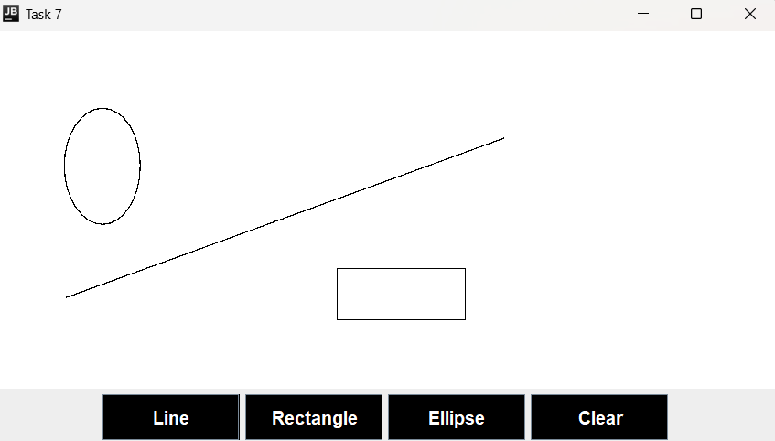

# Interactive Drawing Application

## 📝 Description
**Task7** is an interactive Java Swing-based drawing application that allows users to draw shapes such as lines, rectangles, and ellipses on a canvas. The application features intuitive mouse-based interactions for drawing and includes options to clear the canvas for fresh creations.

---

## 🚀 Features
- **Shape Drawing**: Draw lines, rectangles, and ellipses by selecting the respective shape buttons.
- **Real-Time Updates**: See your shapes update dynamically as you drag the mouse across the canvas.
- **Canvas Reset**: Clear the canvas with a single button to start over.
- **Customizable Interface**: Stylish buttons for shape selection and canvas interaction.

---

## 🖥️ Technologies Used
- **Java Swing**: For graphical user interface.
- **Java AWT**: For event handling and rendering 2D shapes.
- **Graphics2D**: To draw shapes dynamically on the canvas.

---

## 📸 Screenshot



---

## 🛠️ How to Run
1. Clone this repository:
   ```bash
   git clone https://github.com/your-username/task7-drawing-app.git
   ```
2. Navigate to the project directory:
   ```bash
   cd task7-drawing-app
   ```
3. Compile the Java program:
   ```bash
   javac Task7.java
   ```
4. Run the application:
   ```bash
   java Task7
   ```

---

## 🧮 How to Use
1. **Select a Shape**: 
   - Click on one of the buttons (`Line`, `Rectangle`, `Ellipse`) to choose the shape you want to draw.
2. **Draw on the Canvas**:
   - Click and drag the mouse to draw the selected shape on the canvas.
3. **Clear the Canvas**:
   - Click the `Clear` button to erase all shapes and start fresh.

---

## 📂 Project Structure
```
.
├── Task7.java         # Main application file
├── README.md          # Project documentation
└── screenshot.png     # Screenshot of the application (to be added)
```
